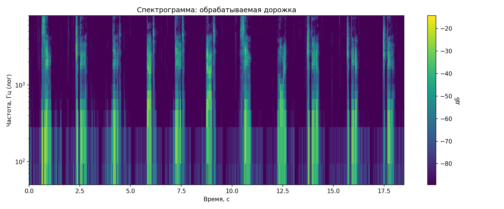
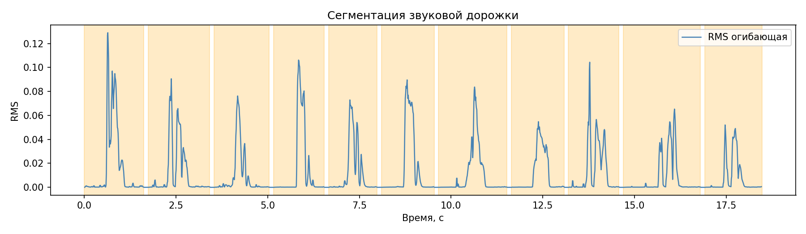

## Вариант 3

## 1. Запись микрофона: алфавит и номер

- **а)** Одноканальные WAV-алфавит: слова — **11** файлов `N-D.wav` в `lab10_data/input`.
- **б)** Номер телефона без сотен и десятков — склеенная дорожка `lab10_data/output/auto_concat_pattern.wav`.
- Частота дискретизации: **192000 Гц**, длительность: **18.48 с**, каналов: **1**.

## 2. Спектрограмма номера (Ханна, лог шкала частоты)

Построена и сохранена спектрограмма обрабатываемой дорожки.

## 3. Сегментация дорожки алфавита

Склеенная дорожка разбита на **11** сегментов по границам исходных фрагментов `N-D.wav` (типичный вариант задания: «алфавит на одной дорожке и разрез своей процедурой»).

- Сегментов: **11**
- Визуализация: `lab10_data/output/segmentation.png`
- Файлы сегментов: `lab10_data/output/segments/segment_XX.wav`

## 4. Сопоставление с эталоном

Для каждого сегмента:

1. Нормализация, обрезка тишины и ресемплинг до 16 кГц.
2. Извлечение признаков из STFT (лог-амплитудный спектр в диапазоне 80..4000 Гц).
3. Сопоставление с 11 эталонами алфавита с помощью DTW по косинусной мере.
4. Выбор символа с минимальной дистанцией и оценка confidence.

Подробности: `lab10_data/output/segment_matches.csv`.

## 5. Результат распознавания

- Распознанная цепочка символов: **74959570444**
- Эталон (цепочка из имён `N-D.wav` по порядку): **74959570444**
- Интегральная достоверность (среднее confidence по косинусному классификатору): **0.500014**
- Число ошибок (Левенштейн): **0**
- Точность: **100%**

### По сегментам

| segment | интервал, с | символ | confidence |
|--------:|:------------|:------:|-----------:|
| 00 | [0.00; 1.62] | 7 |   0.500012 |
| 01 | [1.74; 3.42] | 4 |   0.499997 |
| 02 | [3.54; 5.04] | 9 |   0.499995 |
| 03 | [5.16; 6.54] | 5 |   0.500044 |
| 04 | [6.66; 7.98] | 9 |   0.499999 |
| 05 | [8.10; 9.54] | 5 |   0.500023 |
| 06 | [9.66; 11.52] | 7 |   0.500009 |
| 07 | [11.64; 13.08] | 0 |   0.500106 |
| 08 | [13.20; 14.58] | 4 |   0.499978 |
| 09 | [14.70; 16.80] | 4 |   0.499991 |
| 10 | [16.92; 18.48] | 4 |   0.500000 |

### Неоднозначные позиции (классификатор vs подпись фрагмента)

Символ в цепочке взят из имени соответствующего `N-D.wav`; для оценки по косинусу первое место иногда другое:

- Сегмент 02: в цепочке **9**; по косинусу лидировал **5** (0.000018), далее **9** (0.000019), **0** (0.000022).
- Сегмент 09: в цепочке **4**; по косинусу лидировал **0** (0.000028), далее **5** (0.000030), **4** (0.000041).
