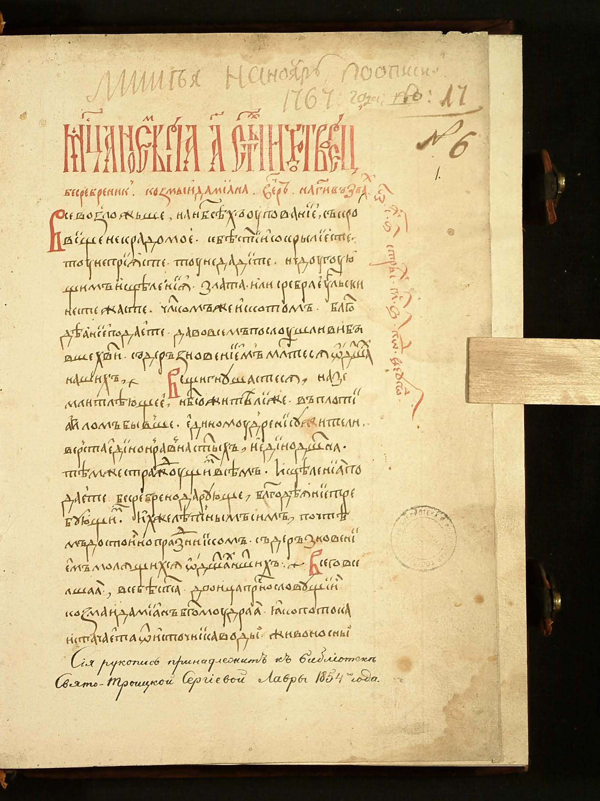
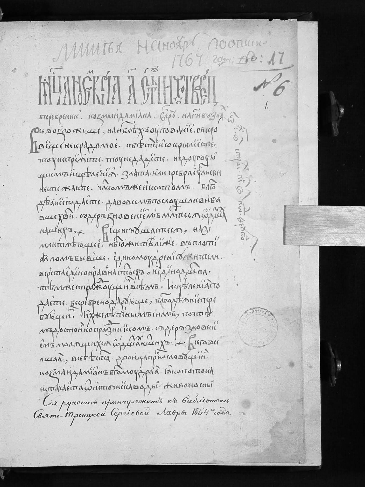
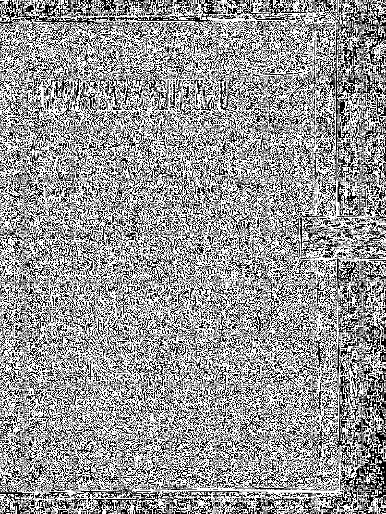
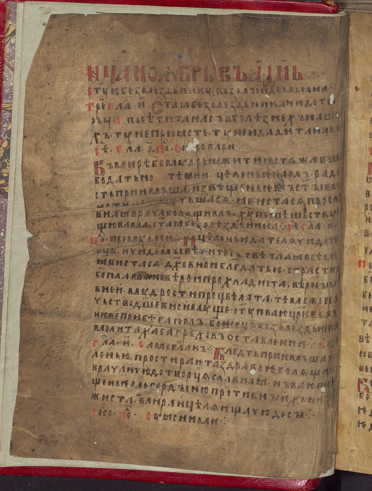
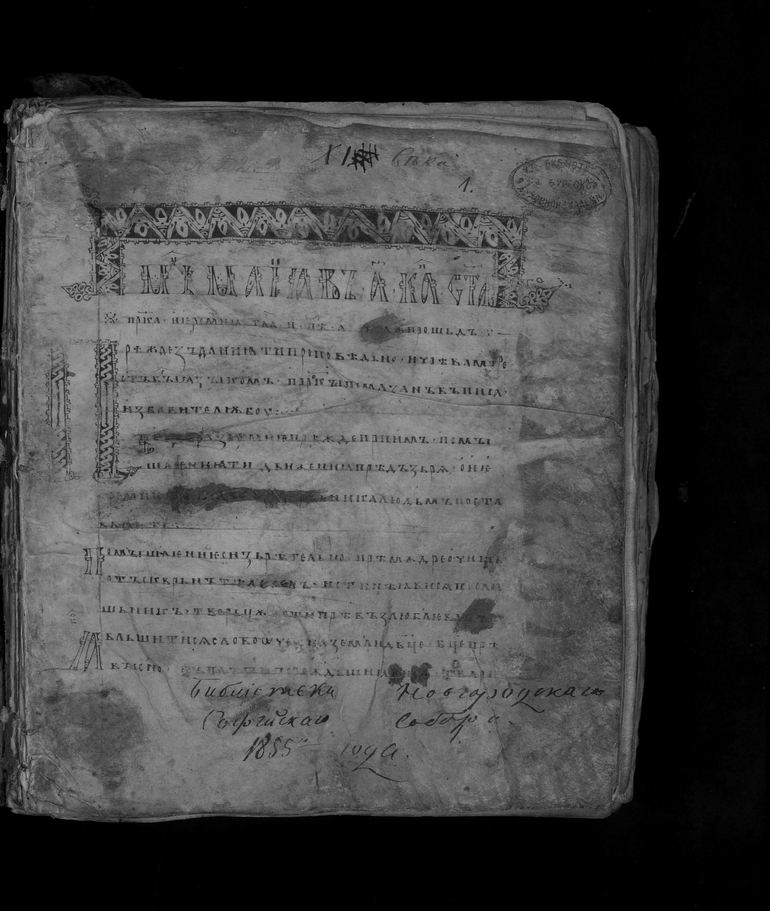
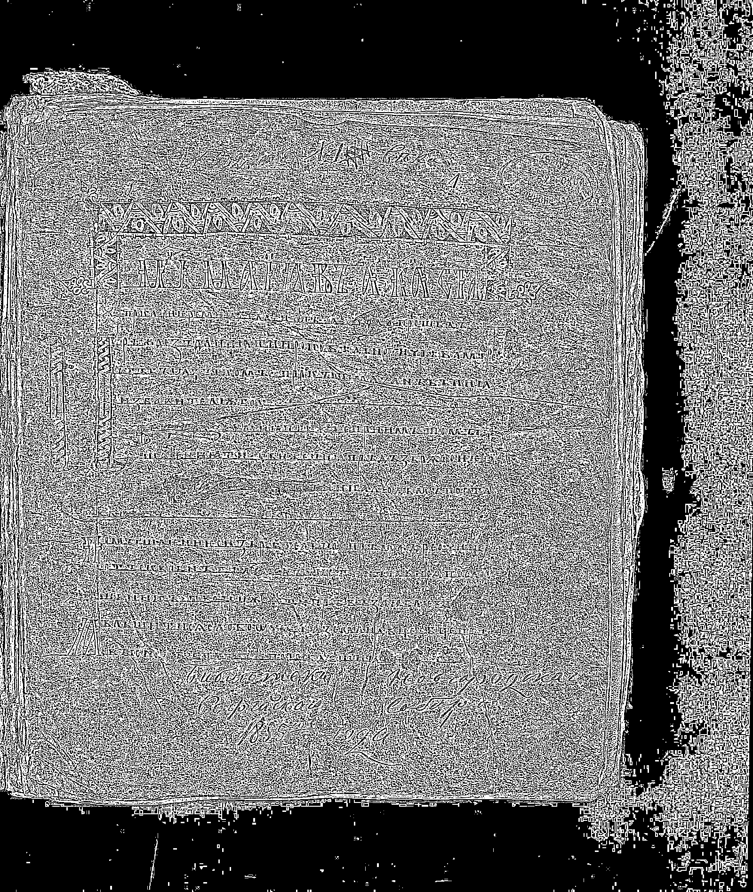
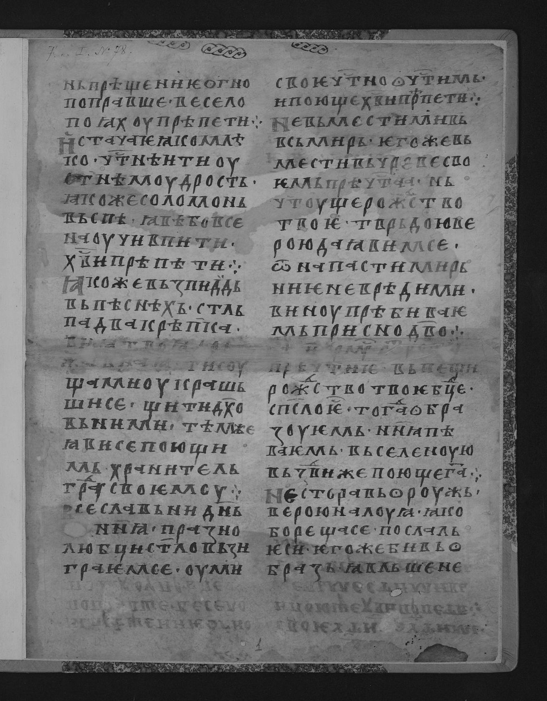
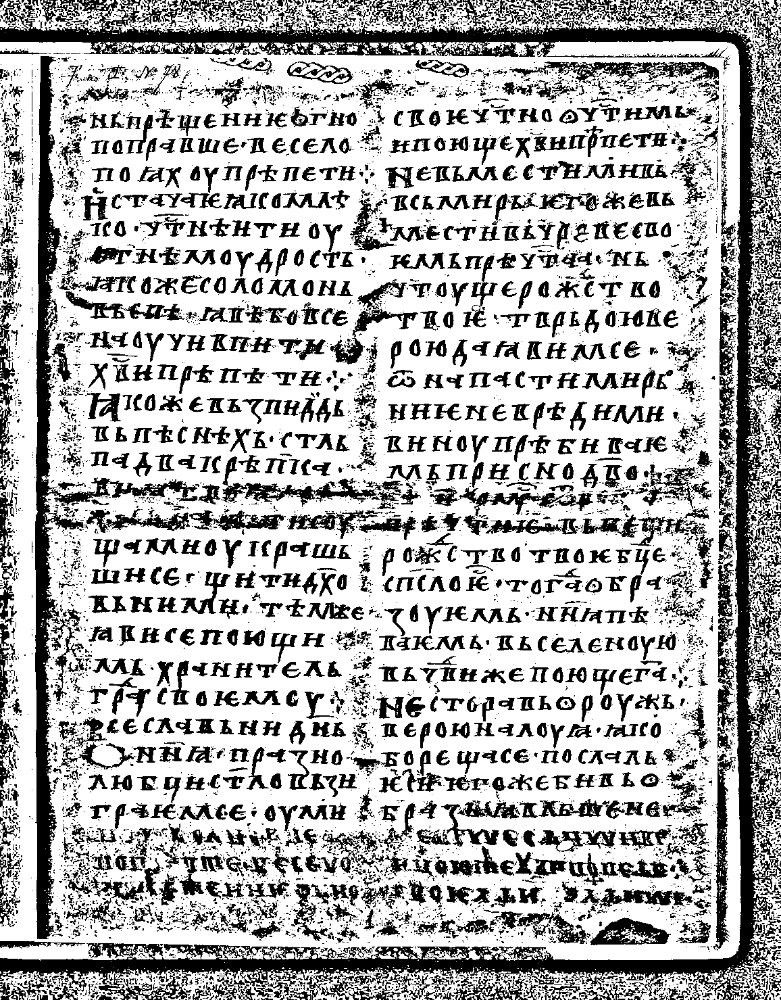

## Задание 1: Приведение к полутоновому изображению

Метод: взвешенное усреднение каналов RGB  
Формула: Y = 0.299·R + 0.587·G + 0.114·B

## Задание 2: Адаптивная бинаризация методом Ниблэка

Порог: T = m + k·s, где:
- m — среднее в окне 5×5
- s — стандартное отклонение в окне 5×5
- k = -0.2

---

### Изображение 1

**До обработки (исходное)**

**После задания 1 (полутоновое)**

**После задания 2 (бинаризация Ниблэка 5×5)**

---

### Изображение 2

**До обработки (исходное)**

**После задания 1 (полутоновое)**

**После задания 2 (бинаризация Ниблэка 5×5)**

---

### Изображение 3

**До обработки (исходное)**

**После задания 1 (полутоновое)**

**После задания 2 (бинаризация Ниблэка 5×5)**

---

### Изображение 4

**До обработки (исходное)**

**После задания 1 (полутоновое)**

**После задания 2 (бинаризация Ниблэка 5×5)**

---

### Изображение 5

**До обработки (исходное)**

**После задания 1 (полутоновое)**

**После задания 2 (бинаризация Ниблэка 5×5)**

---