## Вариант 18
Морфологическое сжатие (эрозия). Структурирующий элемент — кольцо 3×3

## Результаты

### Изображение 1
**До обработки (исходное)**

**После обработки (отфильтрованное полутоновое)**
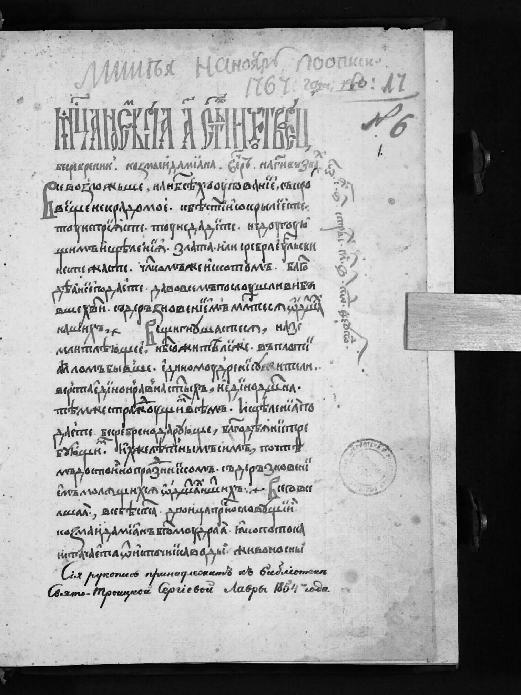

**Разностное изображение (модуль разности)**
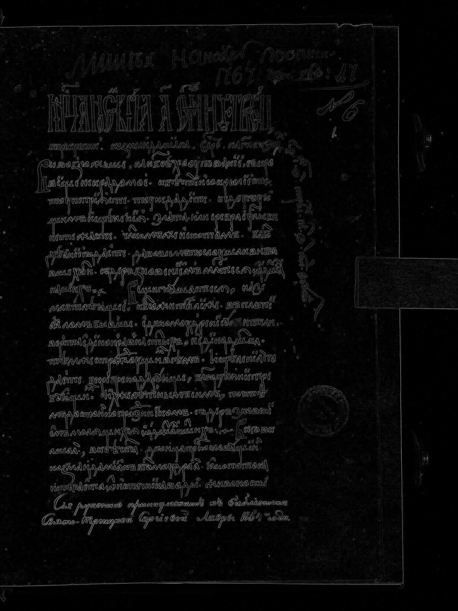

**Разностное изображение (усиленное в 10 раз)**
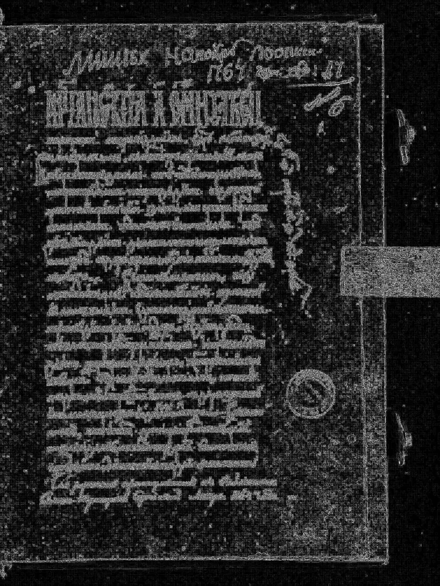

### Изображение 2
**До обработки (исходное)**

**После обработки (отфильтрованное полутоновое)**

**Разностное изображение (модуль разности)**

**Разностное изображение (усиленное в 10 раз)**

### Изображение 3
**До обработки (исходное)**
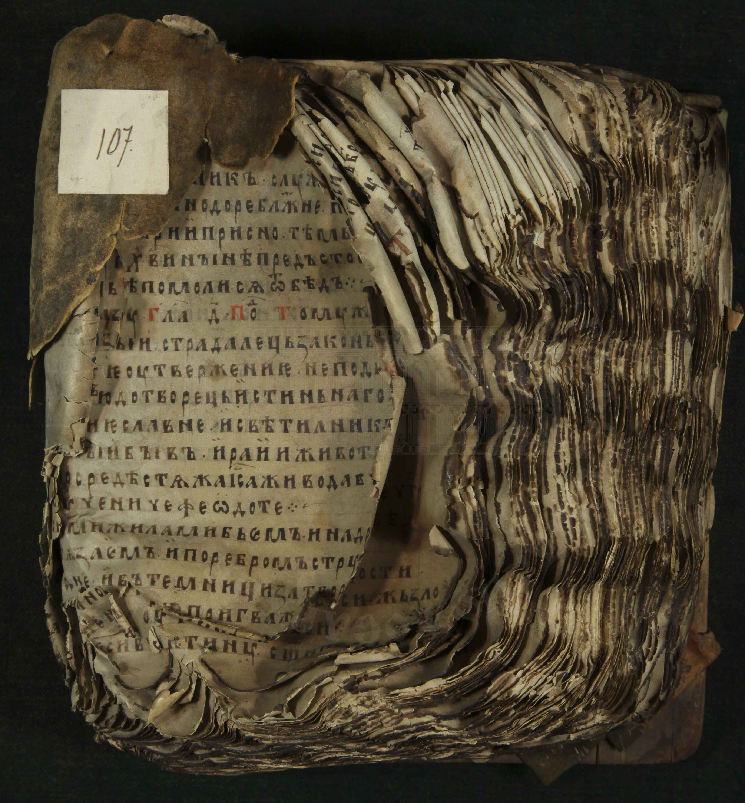

**После обработки (отфильтрованное полутоновое)**
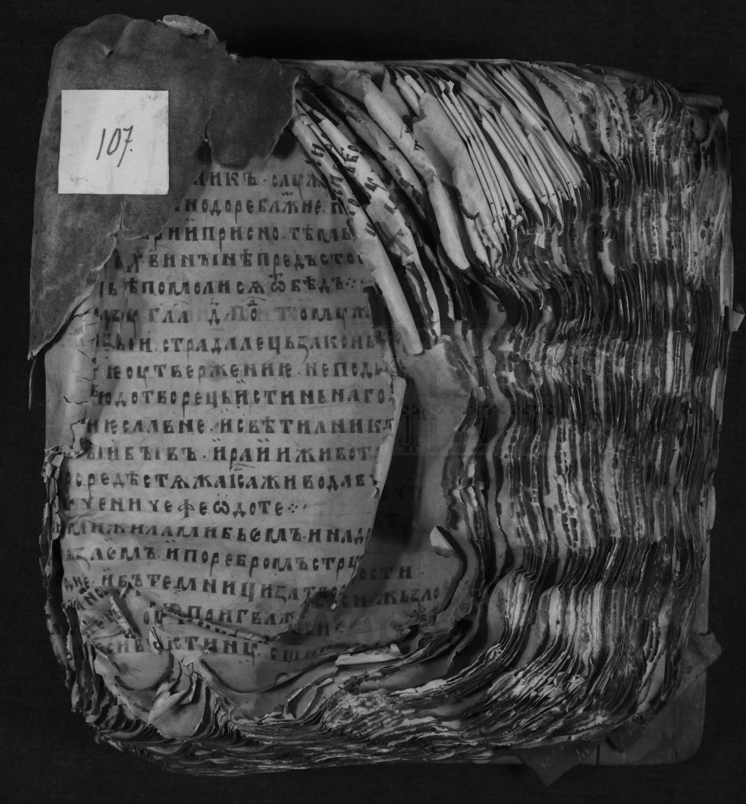

**Разностное изображение (модуль разности)**

**Разностное изображение (усиленное в 10 раз)**

### Изображение 4
**До обработки (исходное)**

**После обработки (отфильтрованное полутоновое)**
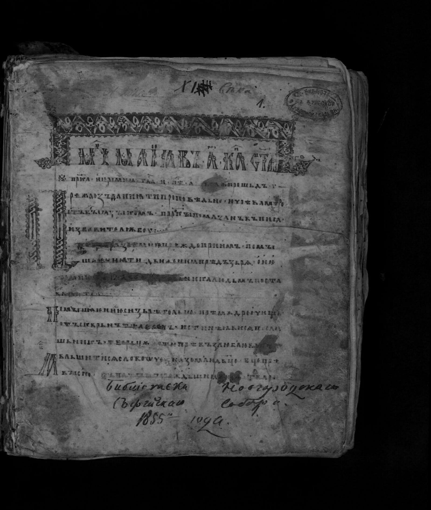

**Разностное изображение (модуль разности)**
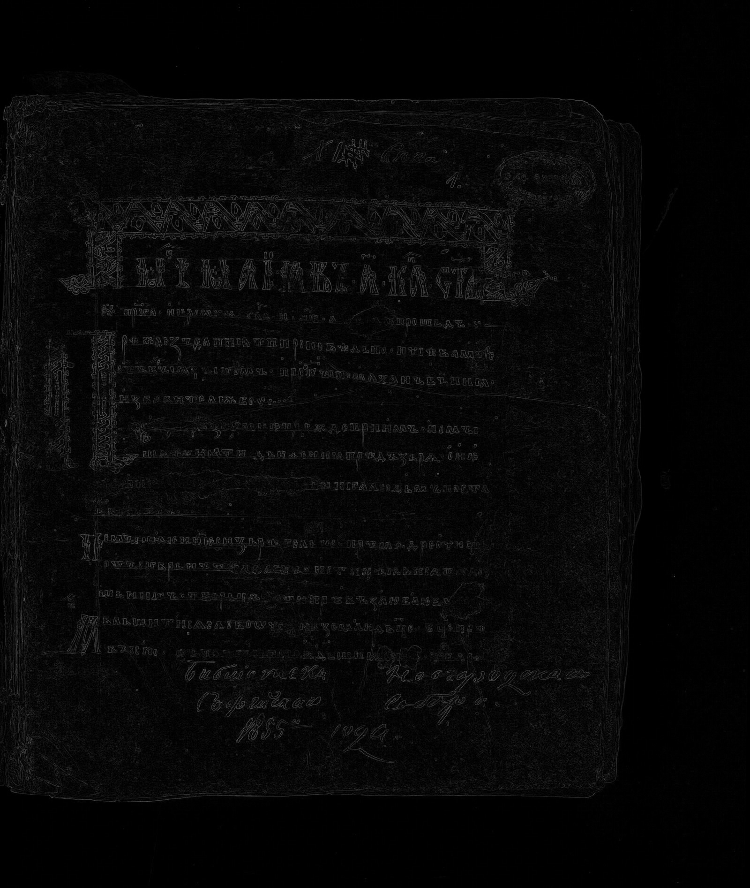

**Разностное изображение (усиленное в 10 раз)**
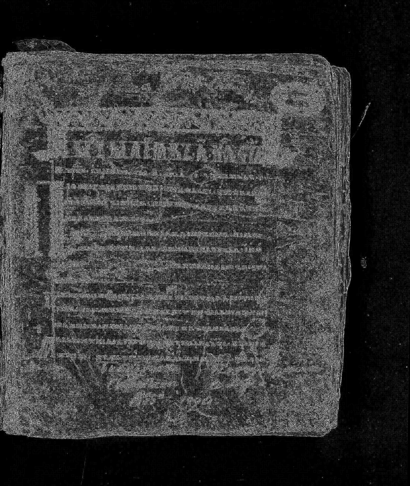

### Изображение 5
**До обработки (исходное)**
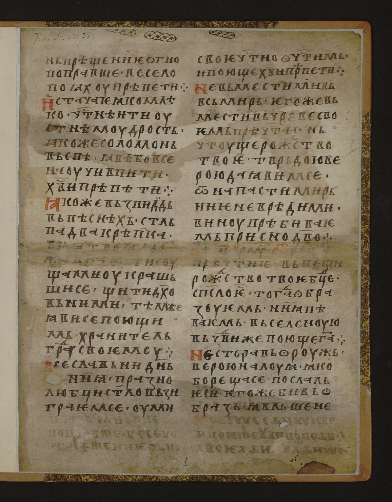

**После обработки (отфильтрованное полутоновое)**
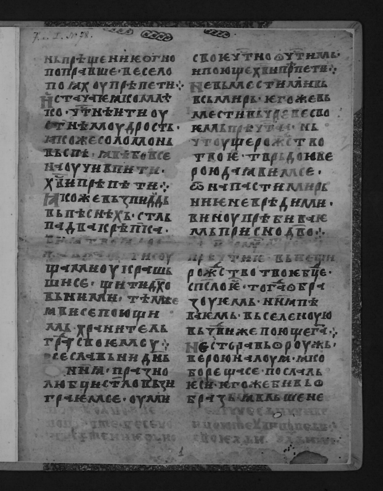

**Разностное изображение (модуль разности)**
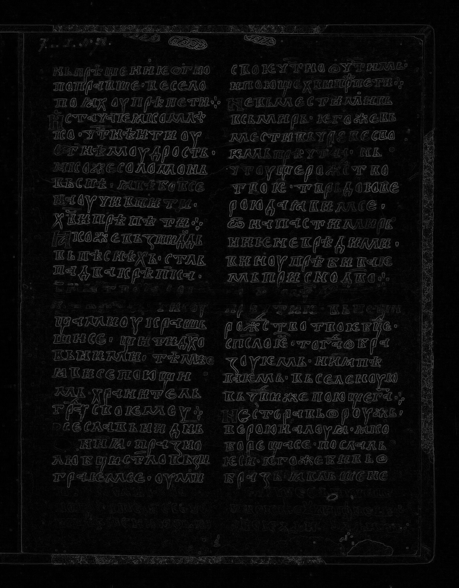

**Разностное изображение (усиленное в 10 раз)**
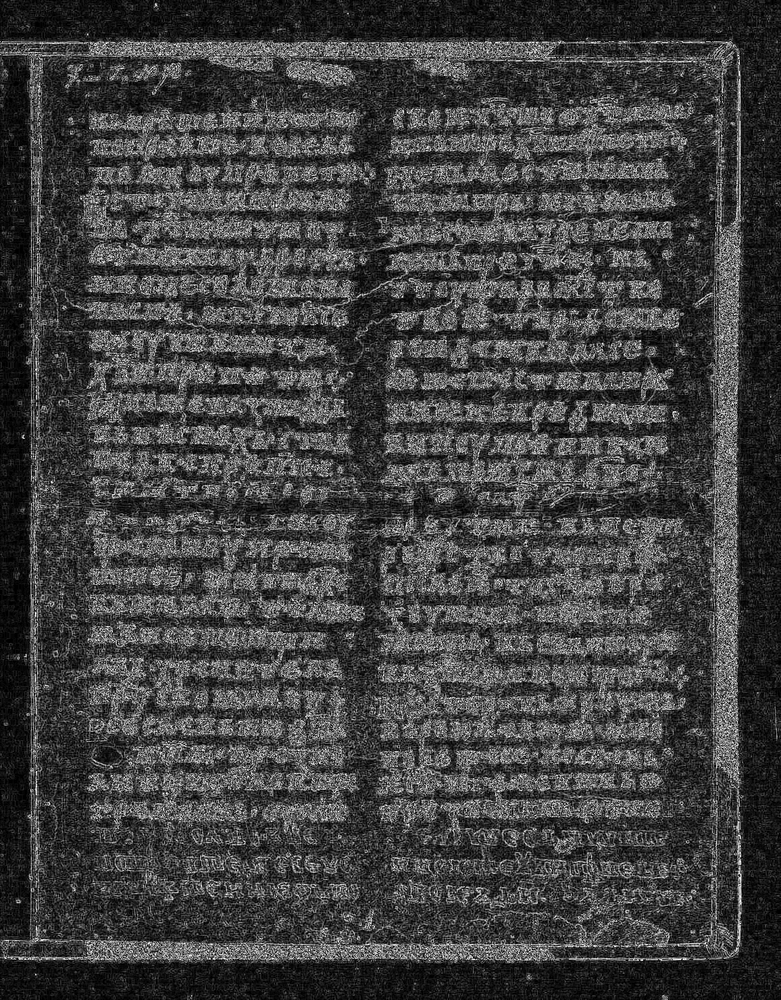