## Результаты

### Изображение 1
**До обработки (исходное)**

**После обработки (полутоновое)**
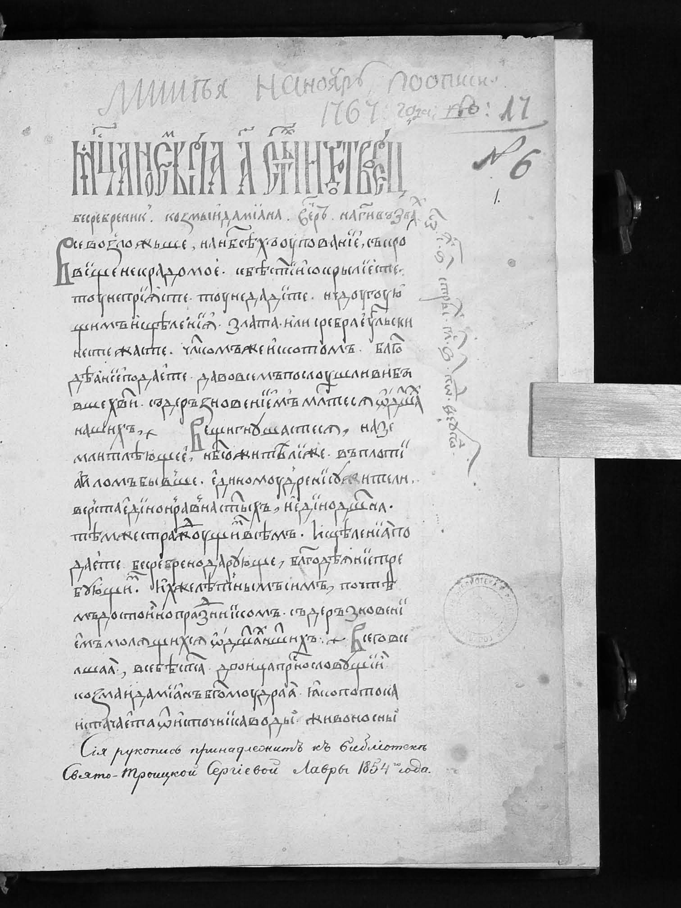

**Градиент Gx**

**Градиент Gy**
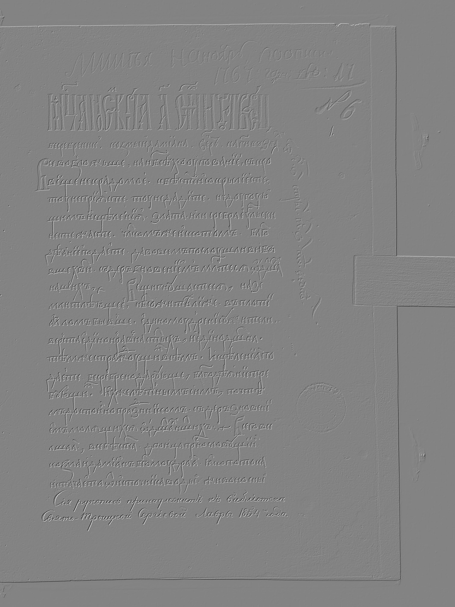

**Градиент G = |Gx| + |Gy|**
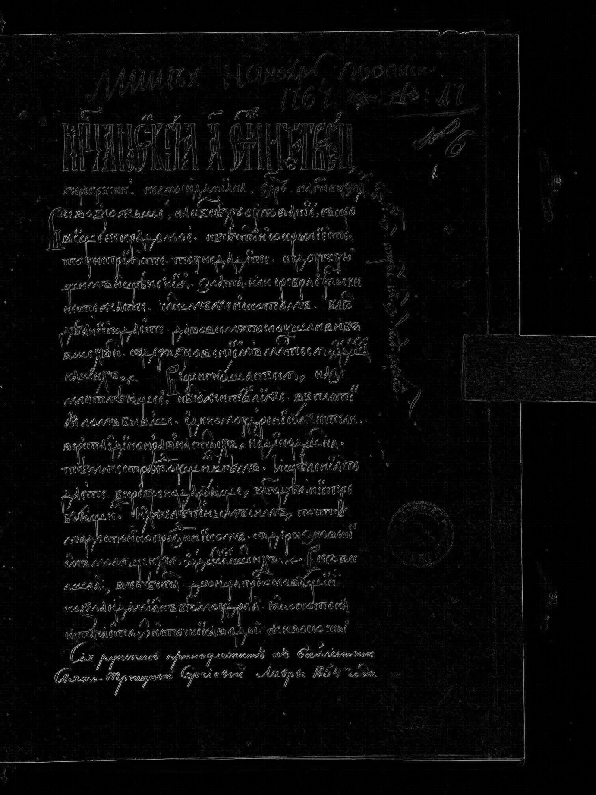

**Бинаризованное изображение (порог 50)**
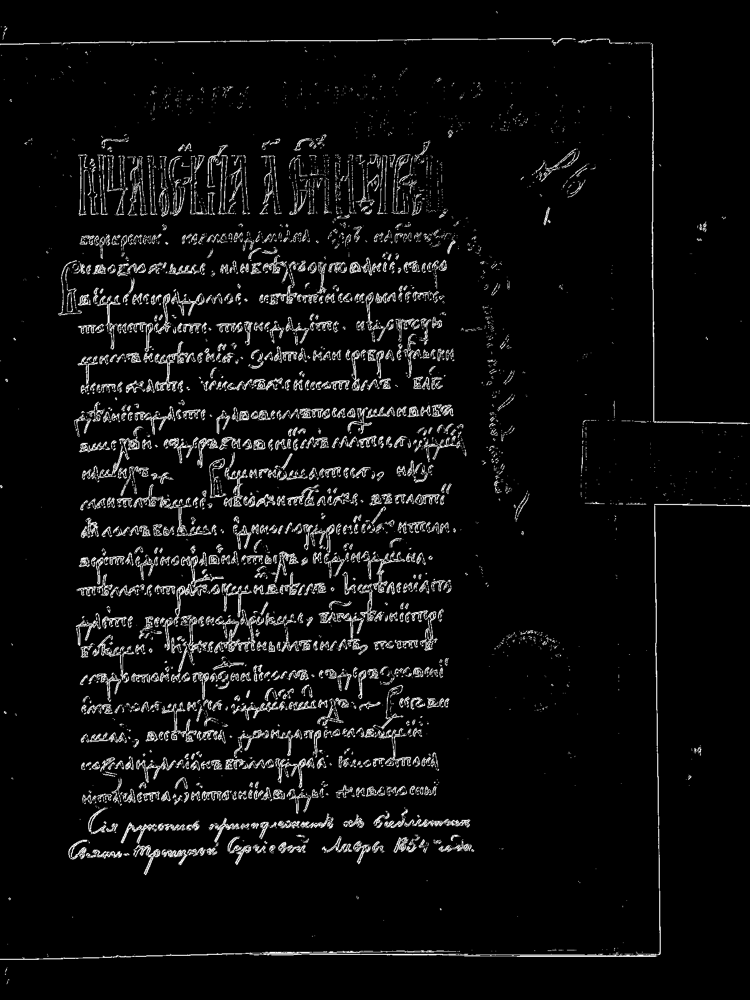

### Изображение 2
**До обработки (исходное)**

**После обработки (полутоновое)**

**Градиент Gx**

**Градиент Gy**

**Градиент G = |Gx| + |Gy|**

**Бинаризованное изображение (порог 50)**
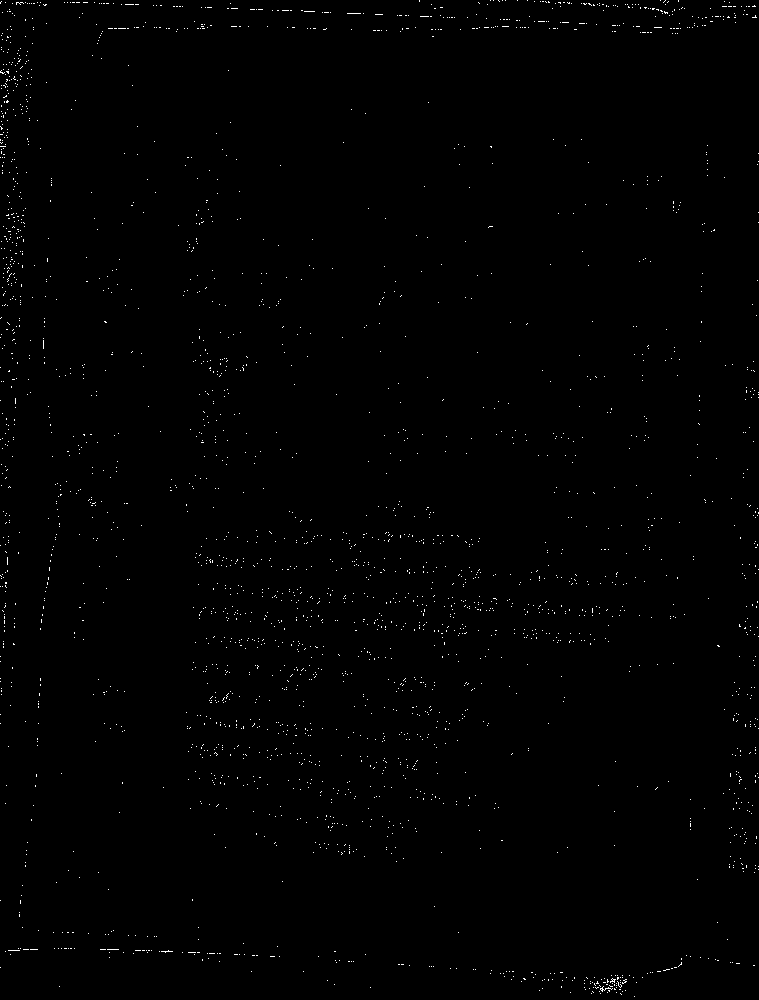

### Изображение 3
**До обработки (исходное)**

**После обработки (полутоновое)**

**Градиент Gx**

**Градиент Gy**

**Градиент G = |Gx| + |Gy|**

**Бинаризованное изображение (порог 50)**
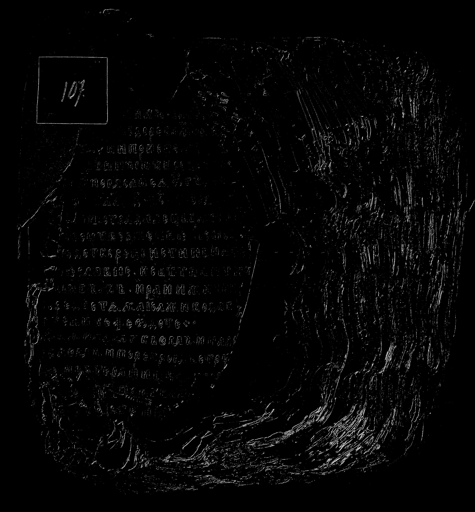

### Изображение 4
**До обработки (исходное)**

**После обработки (полутоновое)**
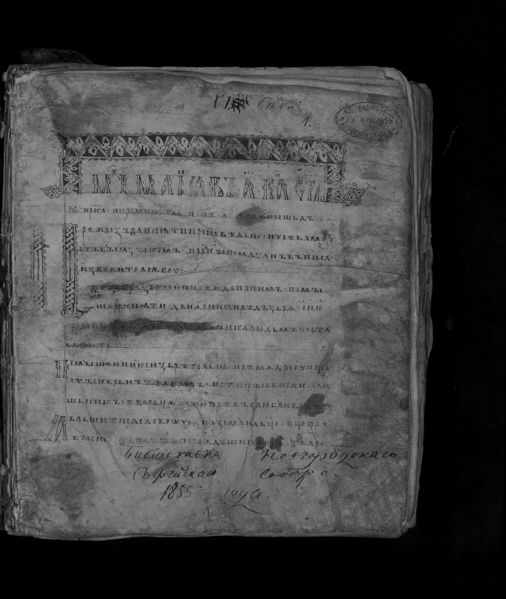

**Градиент Gx**

**Градиент Gy**
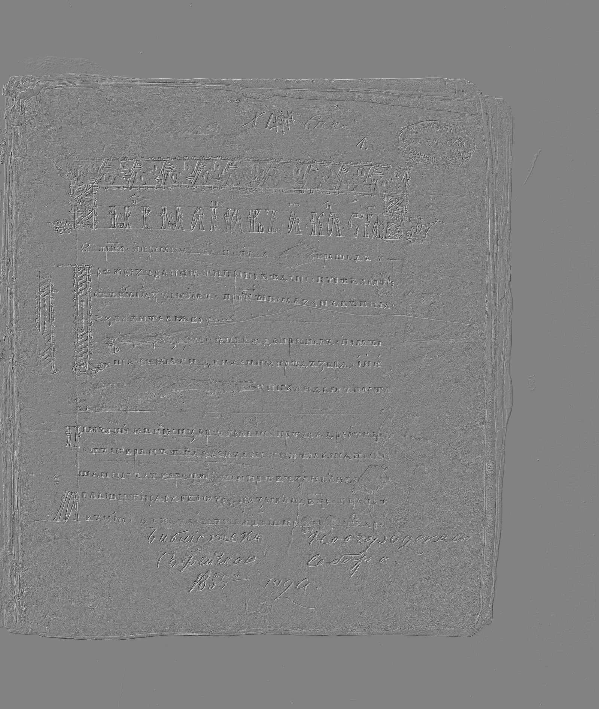

**Градиент G = |Gx| + |Gy|**

**Бинаризованное изображение (порог 50)**
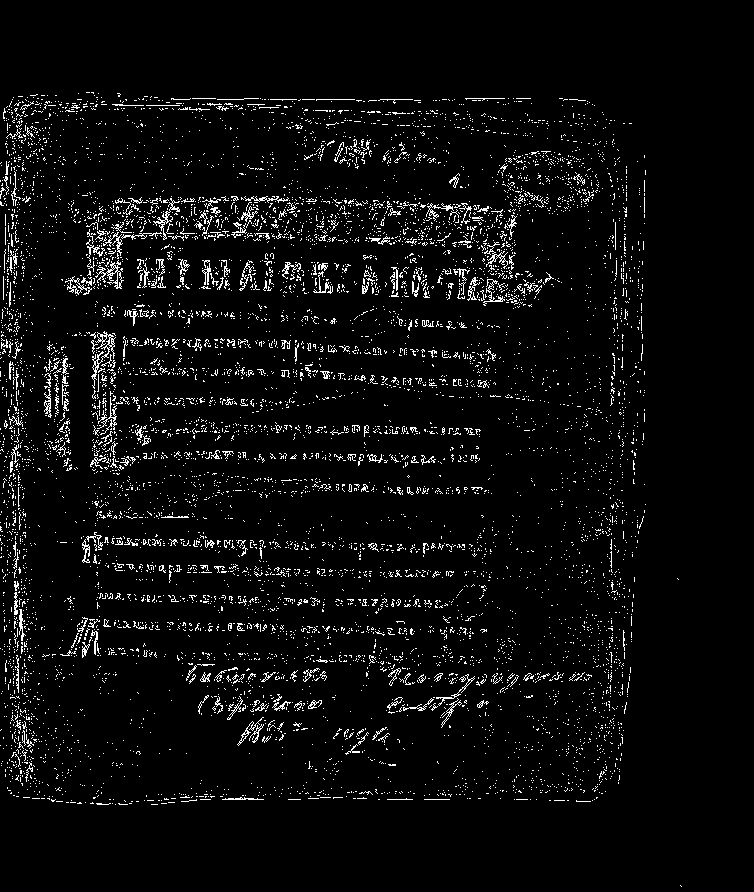

### Изображение 5
**До обработки (исходное)**

**После обработки (полутоновое)**

**Градиент Gx**

**Градиент Gy**
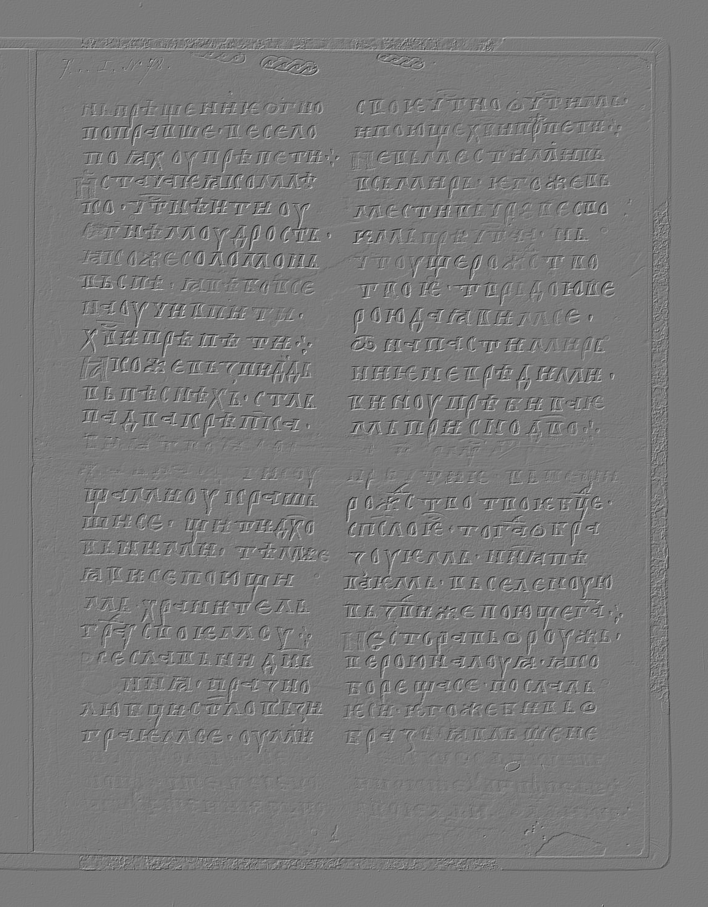

**Градиент G = |Gx| + |Gy|**
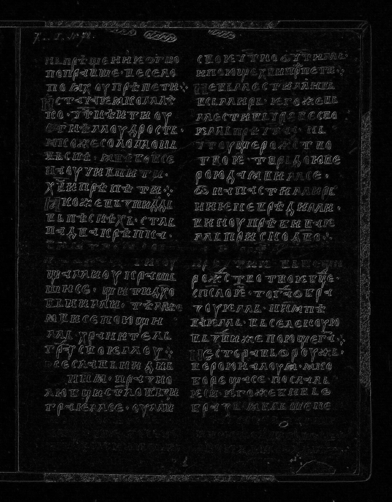

**Бинаризованное изображение (порог 50)**
