# Лабораторная работа №5. Выделение признаков символов

## Вариант 18: Грузинский алфавит (Мхедрули)

#### Генерация эталонных изображений символов

**Параметры генерации:**
- Цвет символа: чёрный (0, 0, 0, 255)
- Фон: прозрачный (255, 255, 255, 0)

---

### 1. Эталонные изображения символов (полный список)

| № | Символ | Название | Unicode | Размер (px) | Изображение |
|:-:|:------:|:---------|:-------:|:-----------:|:-----------:|
| 1 | ა | ani | U+10D0 | 65×69 |  |
| 2 | ბ | bani | U+10D1 | 70×76 |  |
| 3 | გ | gani | U+10D2 | 71×69 |  |
| 4 | დ | doni | U+10D3 | 62×69 | 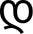 |
| 5 | ე | eni | U+10D4 | 74×81 |  |
| 6 | ვ | vini | U+10D5 | 69×69 | 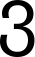 |
| 7 | ზ | zeni | U+10D6 | 86×69 |  |
| 8 | თ | tani | U+10D7 | 62×69 |  |
| 9 | ი | ini | U+10D8 | 68×69 |  |
| 10 | კ | kani | U+10D9 | 67×69 | 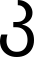 |
| 11 | ლ | lasi | U+10DA | 54×69 |  |
| 12 | მ | mani | U+10DB | 74×69 |  |
| 13 | ნ | nari | U+10DC | 68×69 |  |
| 14 | ო | oni | U+10DD | 79×69 |  |
| 15 | პ | pari | U+10DE | 72×69 | 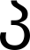 |
| 16 | ჟ | zhani | U+10DF | 64×69 |  |
| 17 | რ | rae | U+10E0 | 64×69 | 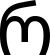 |
| 18 | ს | sani | U+10E1 | 70×69 |  |
| 19 | ტ | tari | U+10E2 | 64×81 |  |
| 20 | უ | uni | U+10E3 | 78×87 |  |
| 21 | ფ | phari | U+10E4 | 74×69 | 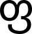 |
| 22 | ქ | kani | U+10E5 | 73×81 |  |
| 23 | ღ | ghani | U+10E6 | 70×69 |  |
| 24 | ყ | qari | U+10E7 | 96×69 |  |
| 25 | შ | shini | U+10E8 | 102×81 |  |
| 26 | ჩ | chini | U+10E9 | 60×69 |  |
| 27 | ც | tsani | U+10EA | 83×69 |  |
| 28 | ძ | dzili | U+10EB | 56×69 |  |
| 29 | წ | tsili | U+10EC | 71×69 |  |
| 30 | ჭ | chari | U+10ED | 89×69 |  |
| 31 | ხ | khani | U+10EE | 54×69 |  |
| 32 | ჯ | jani | U+10EF | 70×69 | 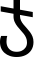 |
| 33 | ჰ | hae | U+10F0 | 78×69 | 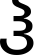 |

---

### 2. Рассчитанные признаки

Для каждого символа рассчитываются следующие признаки:

#### 2.1. Вес чёрного каждой четверти

Изображение символа делится на 4 равные четверти, для каждой вычисляется сумма чёрных пикселей.

#### 2.2. Удельный вес четвертей

Вес каждой четверти нормируется на площадь четверти:

`weight_rel = weight_quarter / area_quarter`

#### 2.3. Координаты центра тяжести

Абсолютные координаты центра тяжести символа:

`cx = (1 / total_weight) * Σ(x * f(x, y))`

`cy = (1 / total_weight) * Σ(y * f(x, y))`

где f(x, y) — бинарная функция яркости (1 — чёрный, 0 — белый).

#### 2.4. Нормированные координаты центра тяжести

`cx_rel = cx / W`

`cy_rel = cy / H`

#### 2.5. Осевые моменты инерции

`Ix = Σ((y - cy)^2 * f(x, y))`

`Iy = Σ((x - cx)^2 * f(x, y))`

#### 2.6. Нормированные осевые моменты инерции

`Ix_norm = Ix / (W * H)`

`Iy_norm = Iy / (W * H)`

#### 2.7. Профили X и Y

Вертикальный профиль (проекция на X):

`ProjX[y] = Σ f(x, y)  по x от 0 до W-1`

Горизонтальный профиль (проекция на Y):

`ProjY[x] = Σ f(x, y)  по y от 0 до H-1`

---

### 3. Пример рассчитанных признаков

#### Символ: ა (ani) (U+10D0)

| Признак | Значение |
|:--------|---------:|
| Размер изображения | 65 × 69 px |
| **Вес четвертей:** | |
| Q1 (верхний левый) | 1126 |
| Q2 (верхний правый) | 845 |
| Q3 (нижний левый) | 489 |
| Q4 (нижний правый) | 372 |
| **Удельный вес четвертей:** | |
| Q1_rel | 0.6998 |
| Q2_rel | 0.5221 |
| Q3_rel | 0.3361 |
| Q4_rel | 0.2366 |
| **Центр тяжести:** | |
| cx | 29.27 |
| cy | 26.33 |
| **Нормированный центр тяжести:** | |
| cx_rel | 0.4503 |
| cy_rel | 0.3817 |
| **Осевые моменты инерции:** | |
| Ix | 28,697.95 |
| Iy | 24,416.75 |
| **Нормированные моменты:** | |
| Ix_norm | 6.40 |
| Iy_norm | 5.45 |

#### Символ: მ (mani) (U+10DB)

| Признак | Значение |
|:--------|---------:|
| Размер изображения | 74 × 69 px |
| **Вес четвертей:** | |
| Q1 (верхний левый) | 886 |
| Q2 (верхний правый) | 887 |
| Q3 (нижний левый) | 708 |
| Q4 (нижний правый) | 708 |
| **Удельный вес четвертей:** | |
| Q1_rel | 0.5164 |
| Q2_rel | 0.5170 |
| Q3_rel | 0.3905 |
| Q4_rel | 0.3905 |
| **Центр тяжести:** | |
| cx | 39.26 |
| cy | 24.83 |
| **Нормированный центр тяжести:** | |
| cx_rel | 0.4970 |
| cy_rel | 0.3598 |
| **Осевые моменты инерции:** | |
| Ix | 23,478.07 |
| Iy | 35,381.33 |
| **Нормированные моменты:** | |
| Ix_norm | 4.31 |
| Iy_norm | 6.49 |

#### Символ: უ (uni) (U+10E3)

| Признак | Значение |
|:--------|---------:|
| Размер изображения | 78 × 87 px |
| **Вес четвертей:** | |
| Q1 (верхний левый) | 2008 |
| Q2 (верхний правый) | 1984 |
| Q3 (нижний левый) | 1376 |
| Q4 (нижний правый) | 1559 |
| **Удельный вес четвертей:** | |
| Q1_rel | 0.8241 |
| Q2_rel | 0.6400 |
| Q3_rel | 0.3402 |
| Q4_rel | 0.1651 |
| **Центр тяжести:** | |
| cx | 32.88 |
| cy | 27.71 |
| **Нормированный центр тяжести:** | |
| cx_rel | 0.4697 |
| cy_rel | 0.3646 |
| **Осевые моменты инерции:** | |
| Ix | 38,128.53 |
| Iy | 27,497.21 |
| **Нормированные моменты:** | |
| Ix_norm | 7.17 |
| Iy_norm | 5.17 |

---

### 4. Профили символов

Профили представлены в виде графиков с линиями и маркерами, целыми числами на осях.

#### Символ: ა (ani) (U+10D0)

| Вертикальный профиль (проекция на X) | Горизонтальный профиль (проекция на Y) |
|:-----------------------------------:|:-------------------------------------:|
| 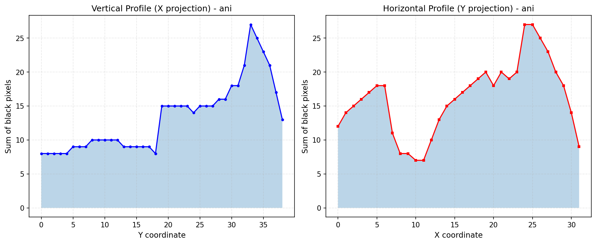 |  |

#### Символ: მ (mani) (U+10DB)

| Вертикальный профиль (проекция на X) | Горизонтальный профиль (проекция на Y) |
|:-----------------------------------:|:-------------------------------------:|
| 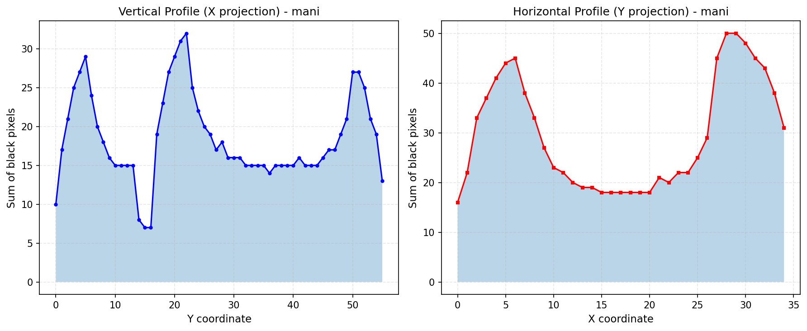 |  |

#### Символ: უ (uni) (U+10E3)

| Вертикальный профиль (проекция на X) | Горизонтальный профиль (проекция на Y) |
|:-----------------------------------:|:-------------------------------------:|
| 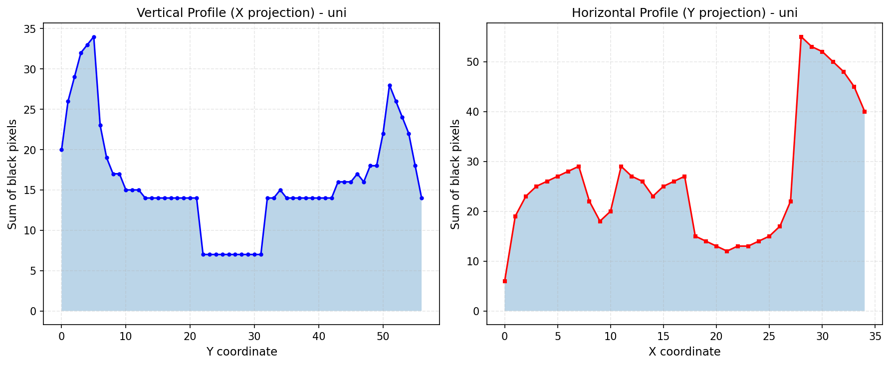 |  |