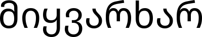
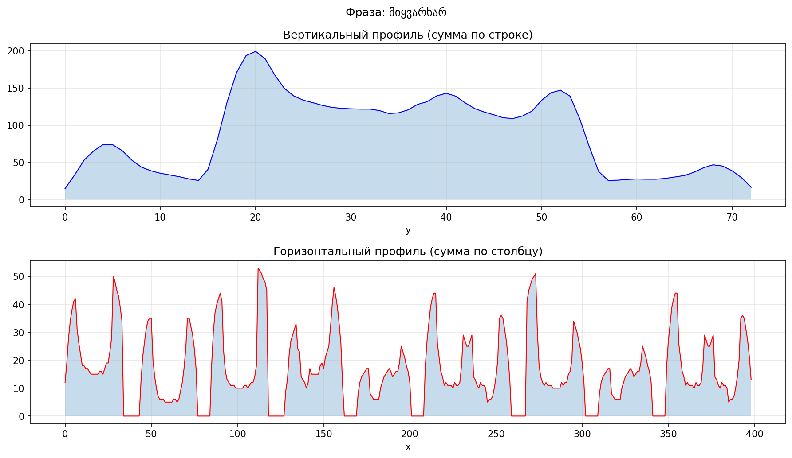
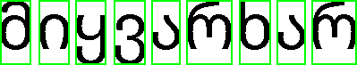
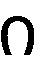
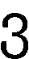
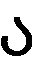
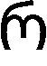
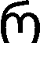

## Вариант 18

Грузинский алфавит.

## Результаты

### 1. Исходная строка (*.bmp)

### 2. Горизонтальный и вертикальный профиль

### 3. Сегментация символов

#### 3.1. Алгоритм сегментации

1. Вычисление вертикального профиля изображения.
2. Прореживание профиля: объединение близких ненулевых областей.
3. Поиск переходов «пусто–заполнено» (начало символа) и «заполнено–пусто» (конец символа).
4. Вырезание символов по найденным границам.

#### 3.2. Результат сегментации с ограничивающими прямоугольниками

#### 3.3. Найденные символы

| № | Координаты X | Размер (px) | Изображение |
|---|--------------|-------------|-------------|
| 1 | [0–34] | 35×73 |  |
| 2 | [43–77] | 35×73 |  |
| 3 | [84–118] | 35×73 |  |
| 4 | [127–162] | 36×73 |  |
| 5 | [169–201] | 33×73 |  |
| 6 | [208–259] | 52×73 |  |
| 7 | [267–302] | 36×73 |  |
| 8 | [309–341] | 33×73 |  |
| 9 | [348–398] | 51×73 |  |

