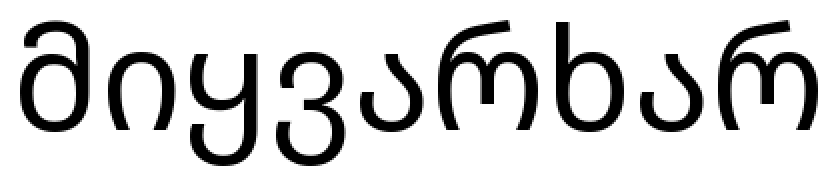
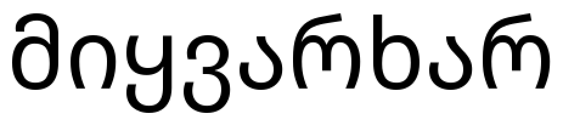
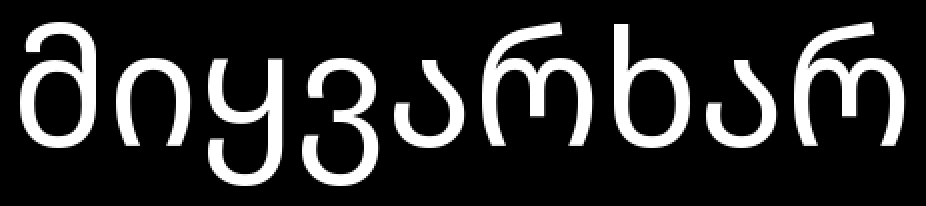

## Вариант 18: грузинский алфавит

Распознаваемая строка:

`მიყვარხარ`

---

## 1. Мера близости по признакам (евклидово расстояние)

- Для каждого символа рассчитываются нормированные признаки: удельная масса чернил, относительные координаты центра тяжести, относительные осевые моменты инерции; эталонные и фрагменты символов приводятся к одному z-масштабу по множеству букв алфавита.
- Мера близости по признакам: `1 - d / d_max`, где `d` — евклидово расстояние в пространстве признаков, `d_max` — максимум попарных расстояний между эталонами букв в этом пространстве.

## 2. Расчёт N гипотез для каждого символа

- Для каждого сегмента строки считаются оценки близости со всеми символами алфавита.
- Гипотезы сортируются по убыванию итоговой оценки `final_score`.

## 3. Вывод гипотез в файл

- Базовая строка: `lab7_data/output/result.csv`, `lab7_data/output/result.txt`
- Увеличенный кегль: `lab7_data/output/result_for_bigger.csv`, `lab7_data/output/result_for_bigger.txt`

## 4. Лучшие гипотезы и восстановление строки

### Исходная строка базовый кегль

### Исходное изображение

Полученное предложение:

`მიყვარხარ`

### Исходная строка увеличенный кегль

Полученное предложение:

`მიყვარხარ`

---

## 5. Количество ошибок и доля верных распознаваний

- Для базового кегля:

  - Ошибки: **0**
  - Точность: **100.00%**

- Для увеличенного кегля:

  - Ошибки: **0**
  - Точность: **100.00%**

## 6. Эксперимент с другим размером шрифта и сравнение

После подбора параметров качество распознавания совпадает для базового и увеличенного кегля.

Оптимальные параметры:

profile_len: 5  
feature_weight: 1.00  
profile_weight: 0.00  
base_acc: 100.00%  
big_acc: 100.00%
