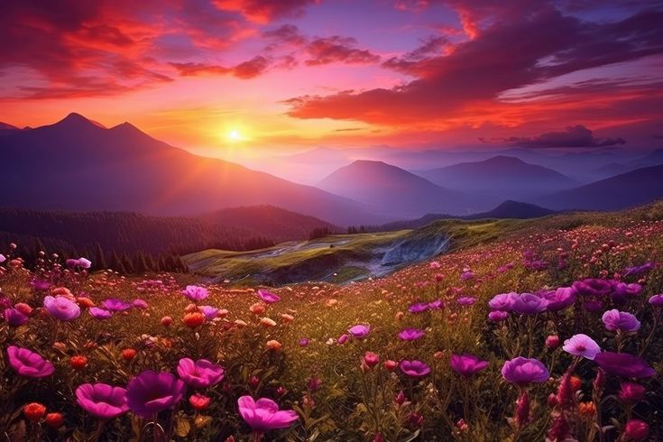
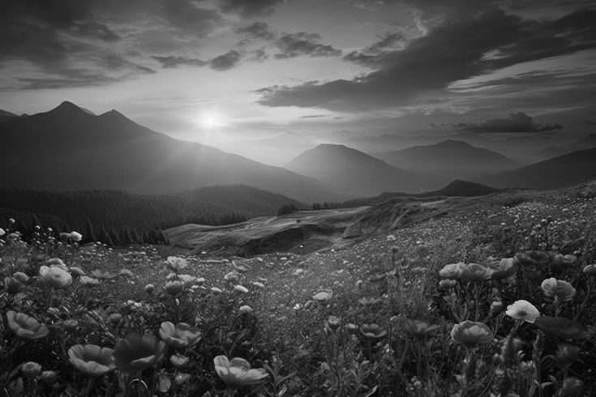
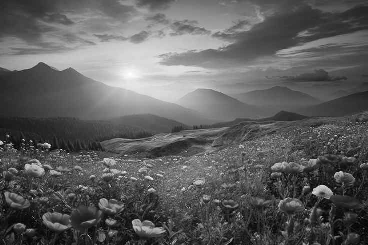
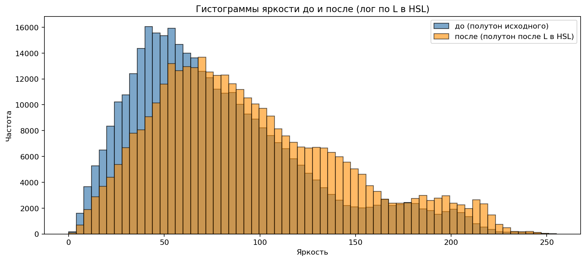
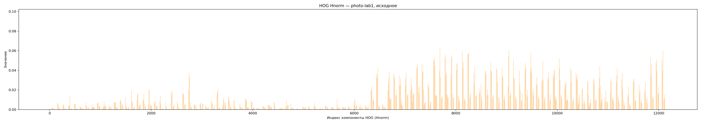

## Вариант 18

- Матрица: **HOG**
- Параметр: **контурный оператор из ЛР4**
- Признаки: **Hnorm**
- Метод преобразования яркости: **логарифмическое**
- Квантование яркости для HOG: **256 уровней**
- Параметр логарифмического преобразования: **L′ = log(1 + L)** с линейной растяжкой **L′** на отрезок **[0, 1]** по текущему кадру

---

## Исходное изображение

## Полутоновое изображение (до)

## Полутоновое изображение (после контрастирования по L в HSL)

## Гистограммы яркости до и после преобразования

## Столбчатые диаграммы HOG (нормировка Hnorm)

### Для исходного полутона

### Для полутона после преобразования

## Сравнение текстурных признаков 

- Косинусная близость векторов **Hnorm** «до» / «после»: **0.997989**
- Евклидово расстояние между **Hnorm** «до» / «после»: **0.063412**

