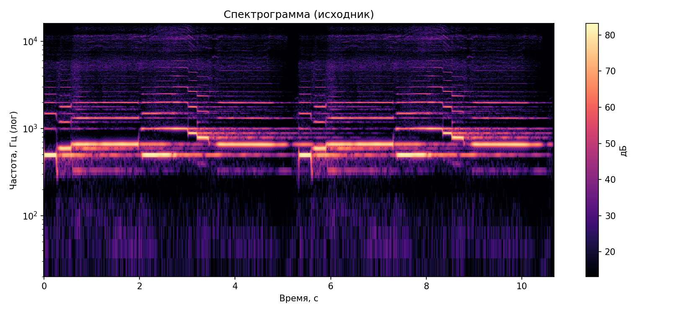
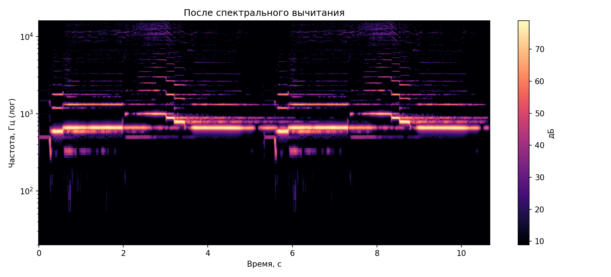
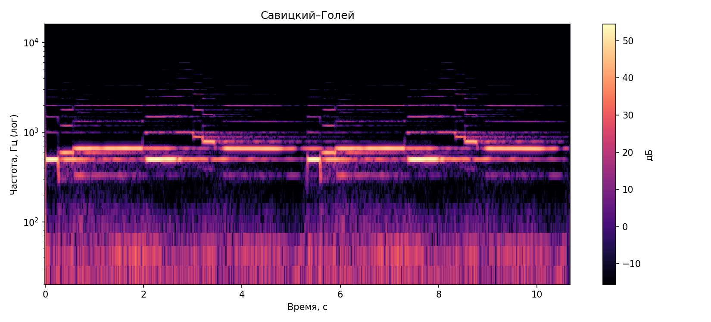
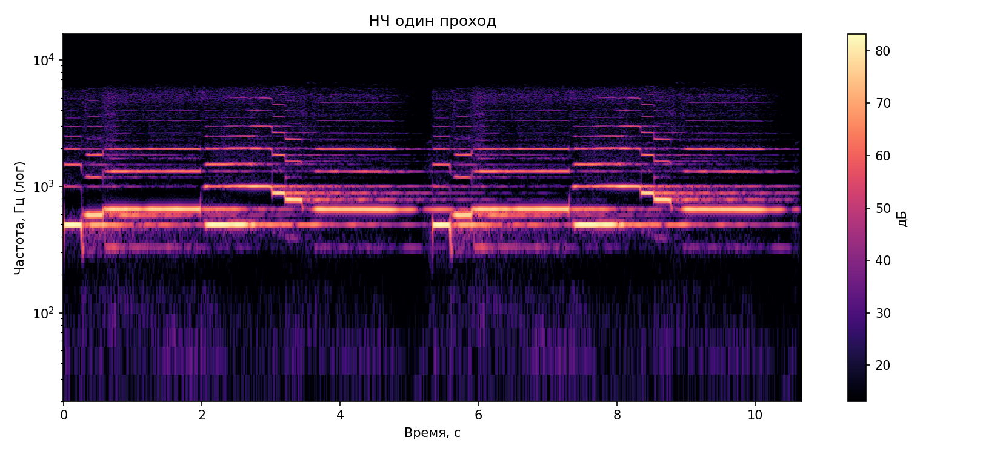

# Лабораторная работа №9. Анализ шума

## 1. Запись инструмента в *.wav

- Исходный файл: **90_Em_Music_SP_62_15.wav**
- Частота дискретизации: **44100 Гц**
- Длительность: **10.667 с**
- Количество каналов: **1** 

## 2. Спектрограмма: STFT, окно Ханна, логарифм по частоте

Построена спектрограмма исходного сигнала с использованием STFT и окна Ханна.
Частота отображается в логарифмической шкале.

## 3. Оценка шума, вычитание, сравнение спектрограмм и восстановление дорожки

### 3.1. Спектральное вычитание

- Коэффициент подавления `k`: **3.2**
- Нижний порог подавления: **0.01**
- Средняя оценка SNR до обработки: **24.195 дБ**
- Средняя оценка SNR после обработки: **31.525 дБ**
- Прирост SNR: **+7.329 дБ**
- Восстановленный файл: `lab9_data/output/pattern_denoised.wav`

### 3.2. Савицкий–Голей и НЧ-фильтр

- SNR-оценка после фильтра Савицкого-Голея: **22.083 дБ**
- SNR-оценка после НЧ-фильтра (1 проход): **24.195 дБ**
- SNR-оценка после НЧ-фильтра (2 прохода): **24.195 дБ**
- Файлы: `lab9_data/output/denoised_savgol.wav`, `lab9_data/output/denoised_lowpass_once.wav`, `lab9_data/output/denoised_lowpass_twice.wav`

## 4. Моменты наибольшей энергии (Δt = 0,1 с; Δf ≈ 45 Гц)

Результаты сохранены в файлах:

- `lab9_data/output/energy_peaks.json`
- `lab9_data/output/energy_peaks.csv`
- `lab9_data/output/energy_peaks.txt`

5 временно-частотных интервалов по энергии:

- 1. `t=[5.43; 5.54] c`, `f=[472.8; 517.8] Гц`, `E=0.001089`
- 2. `t=[0.10; 0.21] c`, `f=[472.8; 517.8] Гц`, `E=0.001080`
- 3. `t=[7.52; 7.63] c`, `f=[472.8; 517.8] Гц`, `E=0.000991`
- 4. `t=[2.19; 2.30] c`, `f=[472.8; 517.8] Гц`, `E=0.000988`
- 5. `t=[2.09; 2.19] c`, `f=[472.8; 517.8] Гц`, `E=0.000931`
